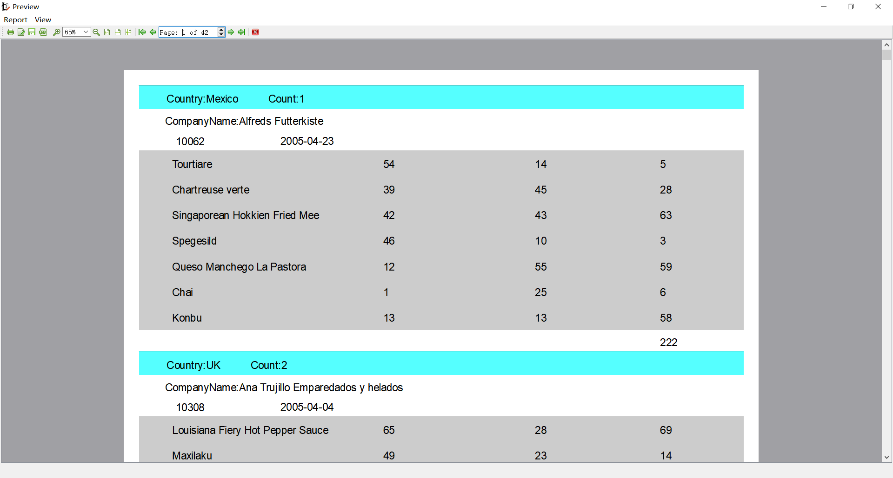

# 简介

一个打印报告的开源项目，地址：[github/fralx](https://github.com/fralx/LimeReport)，

https://github.com/fralx/LimeReport

# 特色

* Multi-platform support    ----    跨平台
* Pure Qt4/Qt5 compatible code    ----    存Qt4/Qt5编写
* Embedded report designer    ----    嵌入报告设计器
* Embedded preview    ----    嵌入预览
* Various band types for a report of any complexity    ----    支持多种复杂的数据类型
* Page header and footer    ----    页眉和页脚
* Data grouping (GroupHeader, GroupFooter, Subdetail, SubdetailHeader, SubdetailFooter)    ----    数据分组
* Aggregation functions (SUM, COUNT, AVG, MIN, MAX)    ----    聚合函数
* Report elements: Text, Geometric (Line, Ellipsis, Rectangle), Picture    ----    支持文字，图形，图片
* Horizontal elements groups    ----    水平分组
* HTML to format input fields    ----    支持 html 格式化字段
* Scripts to format output data    ----    脚本输出格式化数据
* An Automatic band height adjustment    ----    自动行高适应
* A Smart band split moving data to the next page    ----    自动分页
* PDF output    ----    pdf 输出

# 配置

1、下载源码，打开 `LimeReport.pro`，会生成库文件。

2、配置 

* pro 文件中添加 **printsupport qml**

  ~~~properties
  QT += core gui printsupport qml
  ~~~

* 添加外部库

  

~~~properties
win32:CONFIG(release, debug|release): LIBS += -L$$PWD/limereport/win32/debug/lib/ -llimereport
else:win32:CONFIG(debug, debug|release): LIBS += -L$$PWD/limereport/win32/debug/lib/ -llimereportd
~~~

2、在项目中增加头文件

~~~c++
#include "lrreportengine.h"             // to add report engine
#include "lrcallbackdatasourceintf.h"   // if you want use callback datasources

class Demo
{
	LimeReport::ReportEngine m_report;
}
~~~

# Demo

## 分组

1、添加数据库

2、添加数据库语句执行结果

~~~sql
select * from customers
~~~

3、设计报告

* 添加 Data
* 设置 Data 的 DataSource 字段，选中 customer
* 在添加 GroupHeader，并且设置分组的字段 groupFiledName

然后就是设置需要显示的字段咯~

groupBandHeader 中

~~~shell
Country:$D{customers.Country}          Count:$S{COUNT($D{customers.CompanyName},"DataBand1")}
~~~

DataBand1 中

~~~shell
CompanyName:$D{customers.CompanyName}
~~~

点击预览，最后得到结果

## 详细信息

**前面同上面一样，添加数据源**

**添加两个从数据源**

~~~sql
// orders
select * from orders 
where customerid = $D{customers.customerid}
// orderitems
select * from orderitems 
	inner join products on products.productid = orderitems.productid  
where orderid = $D{orders.orderid}
~~~

选中 BandData1 后，选择 SubDetail

同样的，设置 SubDetailHeader1 和 SubDetailBand 的数据源

然后，选择要显示的字段，如上图

**预览显示结果**

## QTableWidget 

添加 table widget 数据为 数据源，其实就是把 tablewidget 的model 设置为 datasources 。具体看 demo 中代码。

